# Slack functional test pipeline setup

This is a step by step guide to setup the Slack functional test pipeline.

## Slack Application setup

We'll need to create a Slack application to connect with the bot.

1. Create App

    Create a Slack App from [here](https://api.slack.com/apps), associate it to a workspace.

    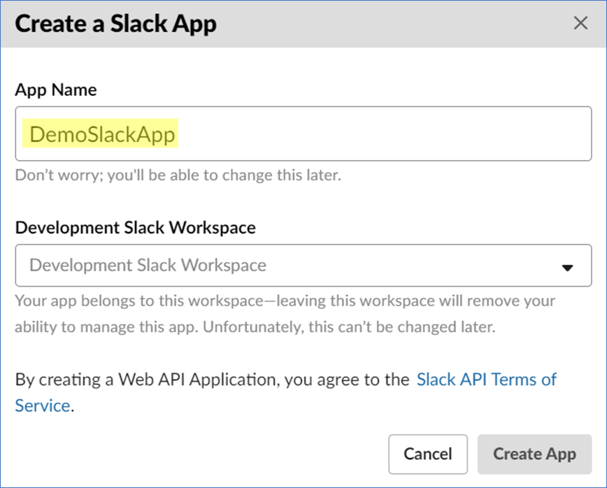

2. Get the Signing Secret and the Verification Token

    Keep the Signing Secret and the Verification Token from the Basic Information tab.

    These tokens will be needed to configure the pipeline.

    - Signing Secret will become *SlackTestBotSlackClientSigningSecret*.
    - Verification Token will become *SlackTestBotSlackVerificationToken*.

    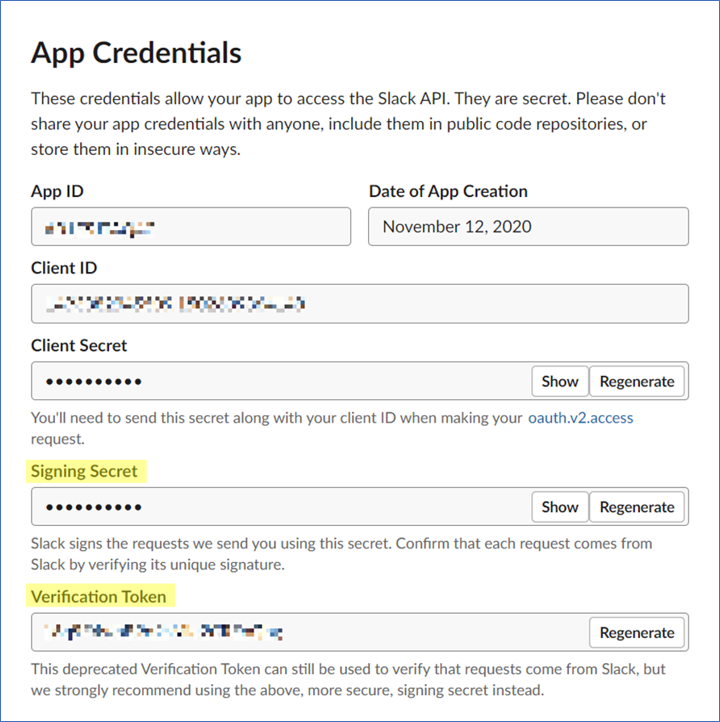

3. Grant Scopes

    Go to the OAuth & Permissions tab and scroll to the Scopes section.

    In the Bot Token Scopes, add chat:write, im:history, and im:read using the Add an Oauth Scope button.

    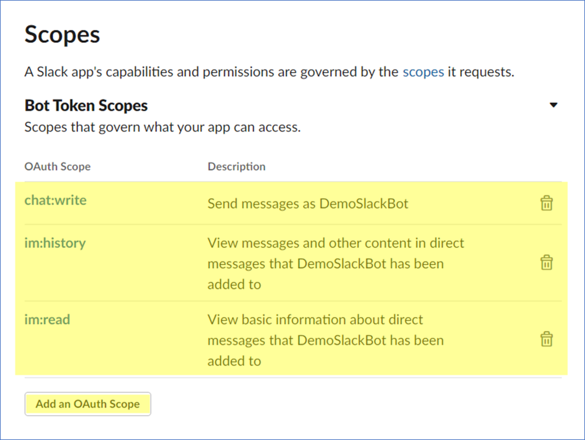

4. Install App

    On the same OAuth & Permissions tab, scroll up to the OAuth Tokens & Redirect URLs section and click on Install to Workspace.

    A new window will be prompted, click on Allow.

    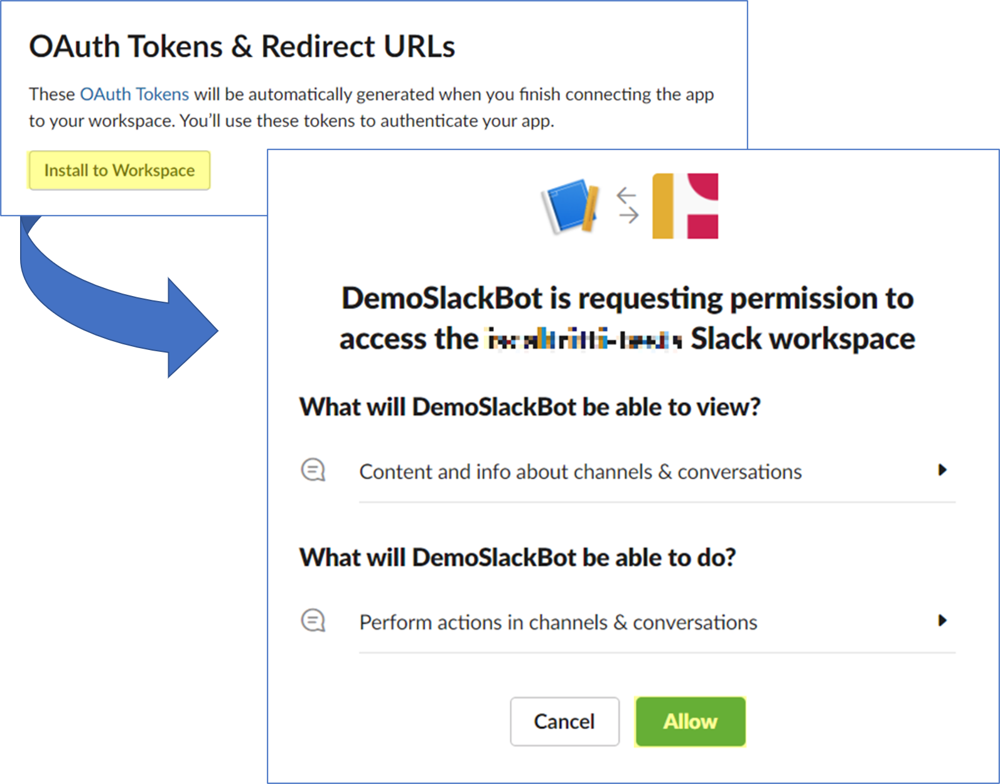

5. Get the Bot User OAuth Access Token

    You will be redirected back to OAuth & Permissions tab, keep the Bot User OAuth Access Token.

    - Bot User OAuth Access Token will become *SlackTestBotSlackBotToken* later in the pipeline variables.

    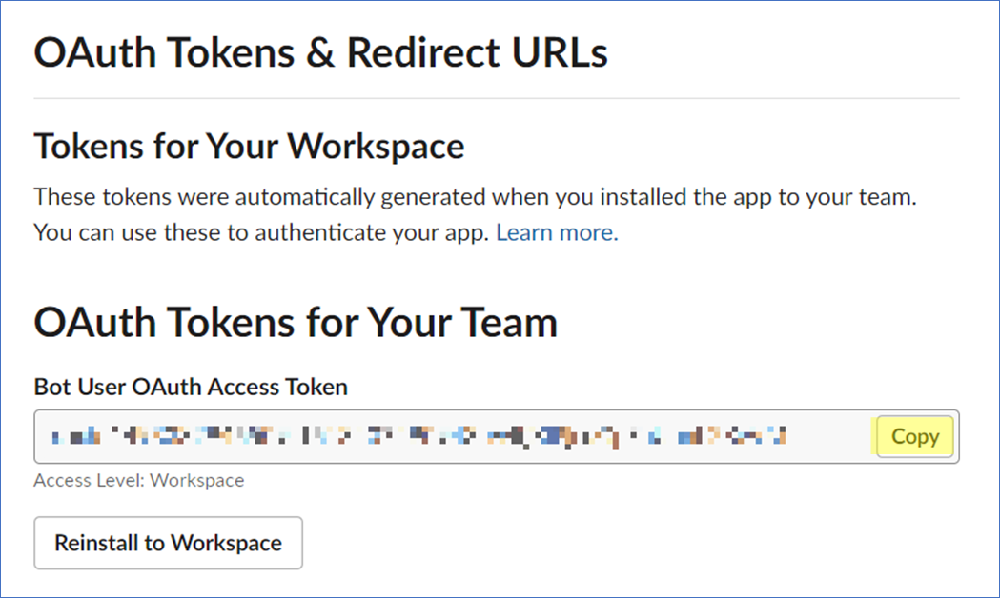

6. Get the Channel ID

    Go to the Slack workspace you associated the app to. The new App should have appeared; if not, add it using the plus sign that shows up while hovering the mouse over the Apps tab.

    Right click on it and then on Copy link.

    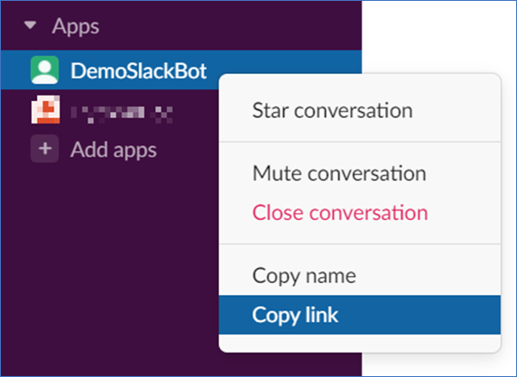

    The link will look something like https://workspace.slack.com/archives/N074R34L1D.

    The last segment of the URL represents the channel ID, in this case, **N074R34L1D**.

    - Keep this ID as it will later become the *SlackTestBotSlackChannel* pipeline variable.

## Azure setup

We will need to create an Azure App Registration and setup a pipeline.

### App Registration

1. Create an App Registration

    Go [here](https://portal.azure.com/#blade/Microsoft_AAD_RegisteredApps/ApplicationsListBlade) and click on New Registration.

    Set a name and change the supported account type to Multitenant, then Register.

    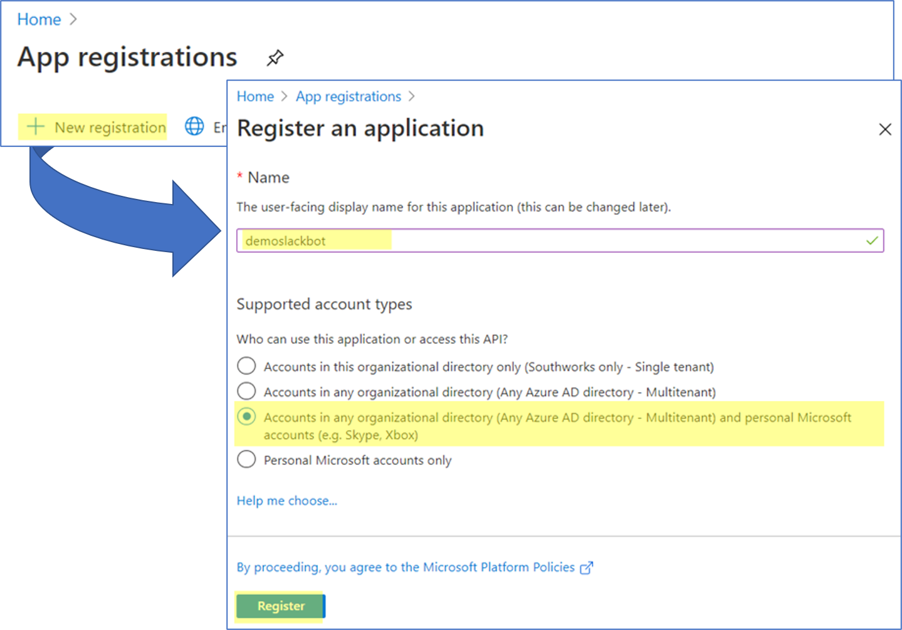

 1. Get the Application ID and client secret values

    You will be redirected to the Overview tab.

    Copy the Application ID then go to the Certificates and secrets tab.

    Create a secret and copy its value.

    - The Azure App Registration ID will be the *SlackTestBotAppId* for the pipeline.
    - The Azure App Registration Secret value will be the *SlackTestBotAppSecret* for the pipeline.

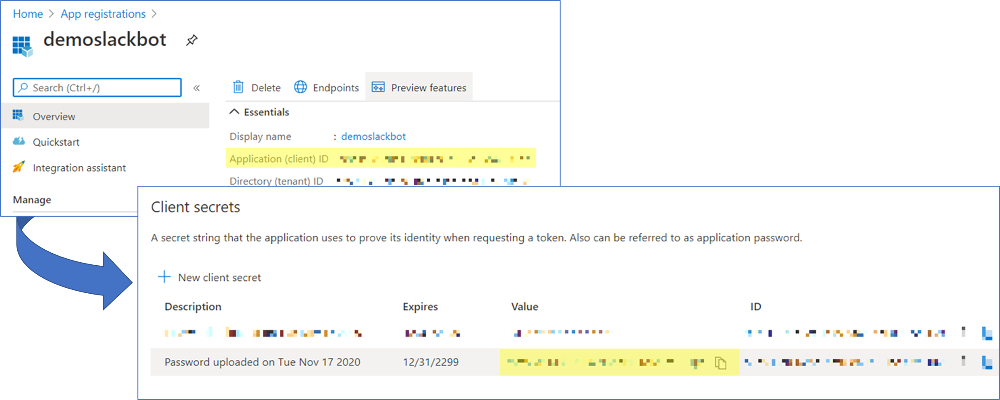

### Pipeline Setup

1. Create the pipeline

    From an Azure DevOps project, go to the Pipelines view and create a new one.

    Using the classic editor, select GitHub, then set the repository and branch.

    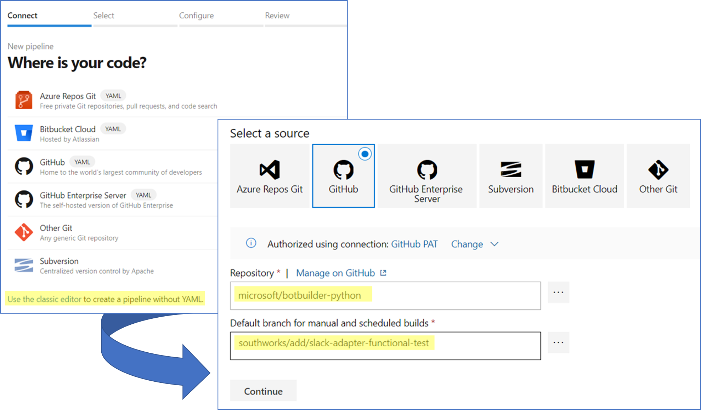

2. Set the YAML

    On the following view, click on the Apply button of the YAML configuration.

    Set the pipeline name and point to the YAML file clicking on the three highlighted dots.

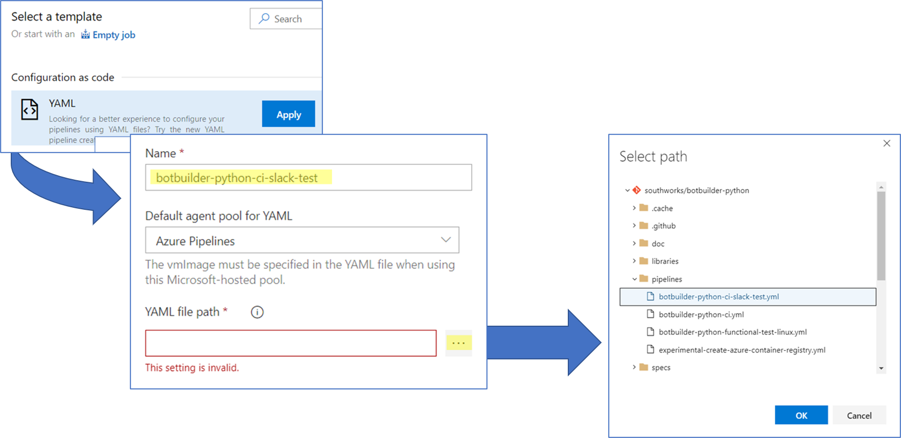

3. Set the pipeline variables

    Finally, click on the variables tab.

    You will need to set up the variables using the values you got throughout this guide:

    |Variable|Value|
    |---|---|
    | AzureSubscription | Azure Resource Manager name, click [here](https://docs.microsoft.com/en-us/azure/azure-resource-manager/management/overview) for more information. |
    | SlackTestBotAppId | Azure App Registration ID. |
    | SlackTestBotAppSecret | Azure App Registration Secret value. |
    | SlackTestBotBotGroup | Name of the Azure resource group to be created. |
    | SlackTestBotBotName | Name of the Bot to be created. |
    | SlackTestBotSlackBotToken | Slack Bot User OAuth Access Token. |
    | SlackTestBotSlackChannel | Slack Channel ID. |
    | SlackTestBotSlackClientSigningSecret | Slack Signing Secret. |
    | SlackTestBotSlackVerificationToken | Slack Verification Token. |

    Once the variables are set up your panel should look something like this:

    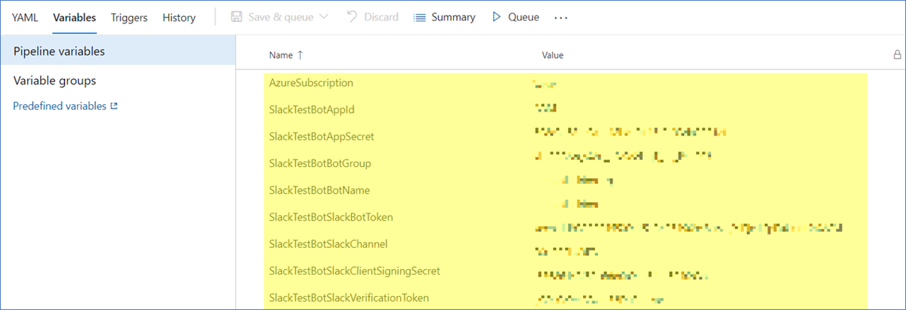

    Click Save and the pipeline is ready to run.
